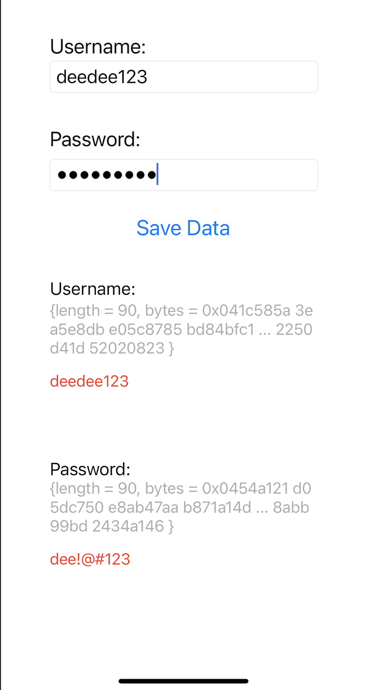

SecureEnclaveExample
===================

A secure enclave provides CPU hardware-level isolation and memory encryption on every server, by isolating application code and data from anyone with privileges, and encrypting its memory. With additional software, secure enclaves enable the encryption of both storage and network data for simple full stack security. 

The application should not store sensitive information in plaintext. If sensitive information such as username, password are necessary to be stored locally, consider encrypting them, or using the Secure Enclave to store such information.

## This project shows you how to:
- Encrypt input value with Secure Enclave 
- Store the encrypted value into keychain.
- Load encrypted data from keychain and decrypt the data back to string value.

